# Baby Matching Bot
### Developer: Edward Gurney

### You can view the live project here: [Baby Name Matcher]
 

## **Table of Contents**

This application helps people find names for their new baby. Each user takes it in turn to respond yes 'y' or no 'n' to 20 randomly generated names as they are presented on screen. There are 100's of names that could be generated. 

The users have the choice of selecting boys names, girls names, or (if they don't know the gender) they can select to be presented with both boy and girl names. 

User 1 goes first and responds to the names, user 2 goes second and responds to the same list of randomly generated names that user 1 received. 

At the end of the session, the users are told which names they chose match. If there were no matches then they are told there were no matches. 
 

## **User Experience**

### *Project Goals*

- The Baby Name Matcher helps expecting couples find names that they like in a slightly different and fun way.

### *Site Owner Goals* 

- The goal of the app is to help couples choose a name for their baby.
- For users to return and play the games many times until they have decided on a name.
- For the users to enjoy it enough to recommend it to friends and family and share the app. 
- To provide a fun way to pick a baby name for any gender. 
- Produce an app that is scaleable, with opportunities to develop and improve through version releases, that could become a commercialised app with baby brands targetting expectant parents who will be the users.
- I want the user to be forced to enter correct inputs before they can proceed at any point. 

### *First Time User Goals* 

- I want to be able to start a game quickly, straight into selecting the gender and then receving the names for me to vote on. 
- I want it to be easy to understand.
- I want to be able to select boy names, girl names or both names (in case I don't know the gender)
- I want it to be easy to play, as little typing as possible.
- I want to be able to play again after each game.
- I want to be able to enter my name and my partners name.
- I want to be able to see the matches that I have with my partner

### *Returning User Goals*

- I want the app to be quick to start going through the names so that I can have quick sessions when I have 5 minutes spare.
- I want to be able to see the matches I have with my partner. 
- I want to have lot's of different names so that I don't get the same names all the time. 

### *Repeat User Goals*

- I want to be able to see my matches with my partner
- I want to have lot's of different names so that I don't keep seeing the same names.

## **Design**

### *Flowchart*

  
Here is the flow chart that was designed at the concept stage of the app. 

  
  
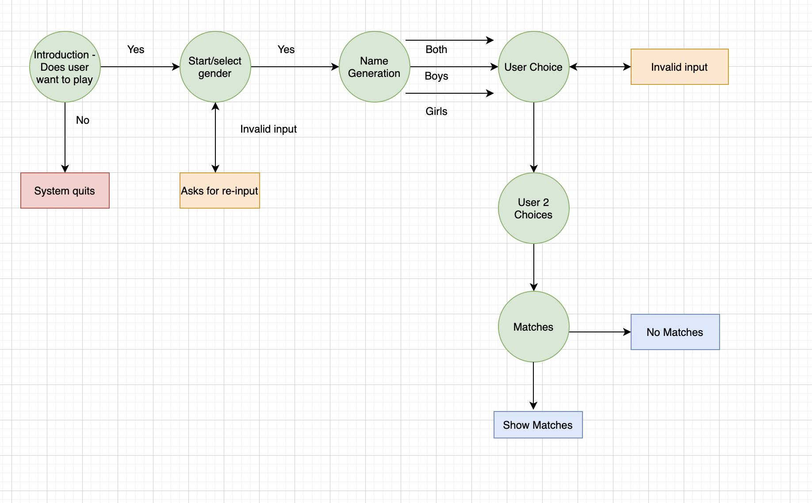

 

## **Technology Used**

### *Languages*
- Python 3

### *Frameworks and Programmes*
- Github
- Gitpod
- Heroku

## **Features**

### **Existing Features**

- Below are descriptions of features, click on the drop down arrow to view image examples.

#### **Welcome Message**

  
There is a welcome message at the start of the app with a polite welcome message from the bot.

  

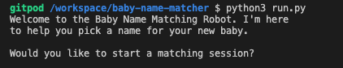

 

#### **Confirm Play**

  
The app will ask if the user wants to play.

  

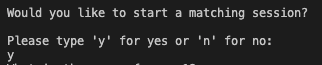

 

#### **Name Entry**

  
Users can enter their names so that the game is personalised to them, enhancing user experience.

  
  
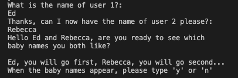

 

#### **Gender Selection**

  
Offers the user the choice of genders for their names, boy, girls or both. 

  
  
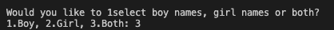

 

#### **Random Names**
- There are hundreds of names stored in the app so that users can play many times and have a decreased chance of seeing the same names.
- The names are never repeated to the same user in the same session.
- User 2 will receive the exact same names that were randomly generated for user 1, to increase the chances of matches. 

  
List of names picture

  
  
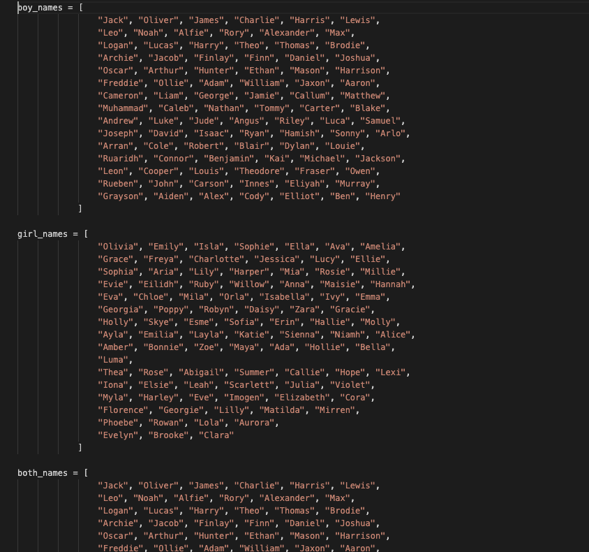

 

#### **List of Matched Names**

  
The users are given a list of the matched names once user 2 has completed their selection. 

  
  
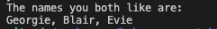

 

#### **Friendly Bot**
- The app/bot talks to the users in a friendly manner, rather than just asking for inputs and presenting answers. 
- The bot will keep them informed of the rules at the start and assist them if they input a wrong response. 

  
This screen shot for example shows the bot advising user 1 that their names are coming

  
  
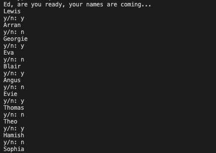

 

### **Screenshots**
- All screenshots are in the above section, click on the drop down arrows to access them.  

### **Features to Implement in future Versions**
- Saving the matched list and having the ability to share it to send to others would be a nice addition. 

- During the process of coding, user 1 and user 2 were presented with their own lists once they had made their selections. this was removed from the final version so that users were just presented with their matches. However, this could be re-introduced pending user feedback.

## **Testing**

## **Languages Used & Validation** - Python.
### **PEP8 Validation**
PEP8 online vailidation was used to check for any errors. All of the code passes with no errors or warning present. All code was returned as 'All Right'. Example screen shots of some of the code are below:

  
This screen shows the top of the file and the code being accepted on Pep8

  
  
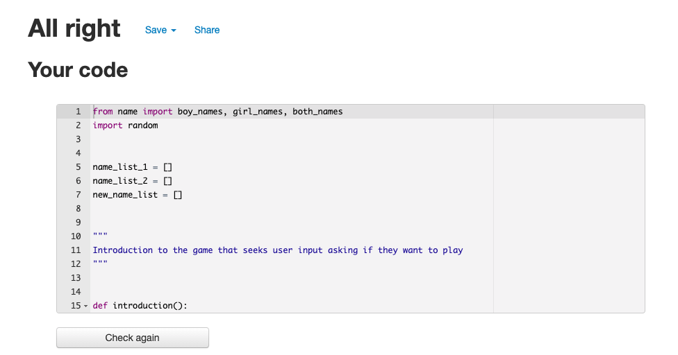

 

  
This screen shows the introduction function and the code being accepted on Pep8

  
  
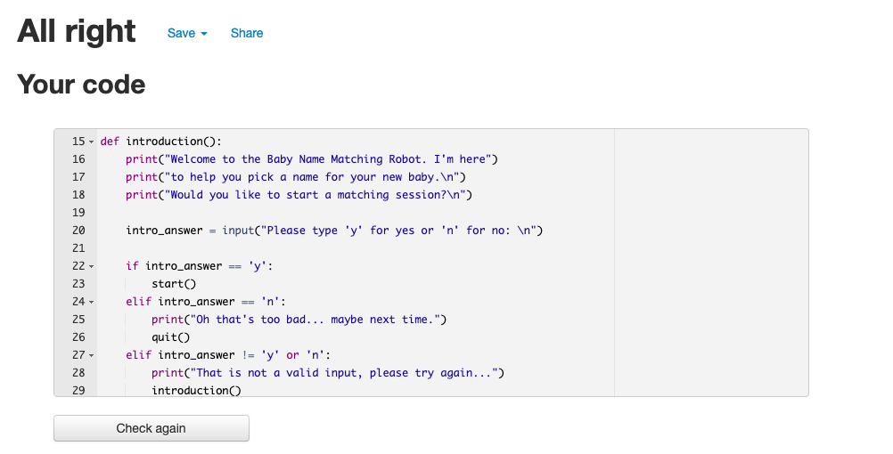

 

  
This screen shows most of the user choice function and the code being accepted on Pep8

  
  
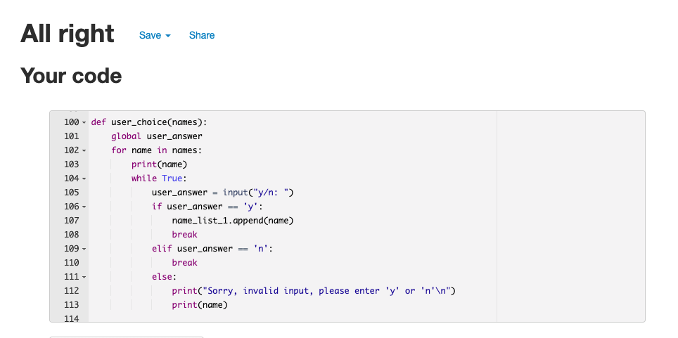

 

  
This screen shows the user check matches function and the code being accepted on Pep8

  
  
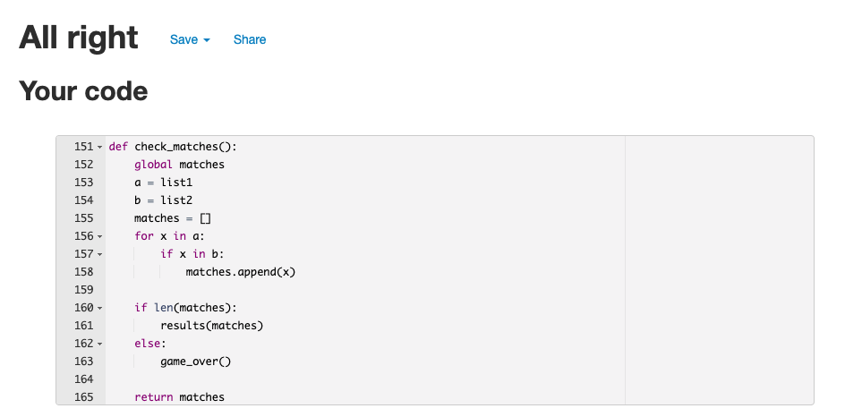

 

  
This screen shows the game over and result functions and the code being accepted on Pep8

  
  
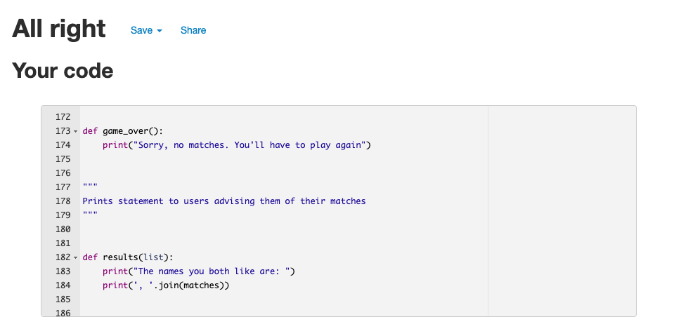

 

  
This screen shows part of the name generation function and the code being accepted on Pep8

  
  
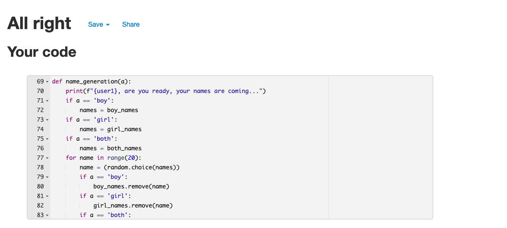

 

## **Bugs**

### Fixed Bugs
- The matches were appearing in list form with the original brackets and quote marks. For example ["Arlo", "James", "Mia"]. This didn't contribute much to user experience. The fix for this was found online (this has been accredited in the credits section), a workround to take these brackets away. After this it still didn't look pleasing to the eye, so I added a new line so the names appeared on their own line.

- The built in functions found online that would be able to find matches, for example using sets (set(a) & set(b)) wasn't having the desired result and was introducing bugs to the program. So I designed my own function, with a for loop and using the len() method to get the desired result. 

 

### Unfixed Bugs

- After significant testing there does not seem to be any bugs at present. 

## **Deployment**

The app was deployed on Heroku in the following steps:

1. Created a Heroku account (or log in if existing user).
2. In the upper right hand corner clicked "New" and then selected "Create New App".
3. Chose a name for the app and region and clicked "Create App".
4. On the settings tab, add python build pack and the node.js build pack.
5. Picked Github as the deployment method on the "deploy" tab.
6. Search for repository 
7. Enable automatic deploys and then deploy branch
8. Once processing has finished click on "View"

 
To clone this repository follow the below steps:

1. Go to the GitHub repository
2. Click on the Coode drop down button and select if you wish to clone with either HTTPS, SSH or Ghib CLI.
3. Click the copy button (clipboard emblem).
4. Open Git Bash (Mac or Windows)
5. Choose the working directory
6. Type git clone to add the copied URL.
7. Press Enter. (This will create your clone).

## **Credits**

- The code used to remove the square brackets and quote marks from the matched named list that is printed to the user at the end of the game was taken from a website called [codegrepper](https://www.codegrepper.com/code-examples/typescript/how+to+print+list+without+brackets+python)

- Assistance for generating random strings from [kishstats](https://www.youtube.com/watch?v=pt3k8pc8f0A&t=549s) on youtube. 

- The flow diagram for the concept stage of the project was done using [diagrams.net](https://www.diagrams.net/)

## **Acknowledgements**

- My mentor Chris Quin for his continued support in my projects (also a mention to Precious who stepped in for Chris for one session for this project).
- My pregnant wife Rebecca for her continued support during many hours working through this course and looking after our daughter whilst I stress out and try and code.

Welcome edwardgurney,

This is the Code Institute student template for deploying your third portfolio project, the Python command-line project. The last update to this file was: **August 17, 2021**

## Reminders

* Your code must be placed in the `run.py` file
* Your dependencies must be placed in the `requirements.txt` file
* Do not edit any of the other files or your code may not deploy properly

## Creating the Heroku app

When you create the app, you will need to add two buildpacks from the _Settings_ tab. The ordering is as follows:

1. `heroku/python`
2. `heroku/nodejs`

You must then create a _Config Var_ called `PORT`. Set this to `8000`

If you have credentials, such as in the Love Sandwiches project, you must create another _Config Var_ called `CREDS` and paste the JSON into the value field.

Connect your GitHub repository and deploy as normal.

## Constraints

The deployment terminal is set to 80 columns by 24 rows. That means that each line of text needs to be 80 characters or less otherwise it will be wrapped onto a second line.

-----
Happy coding!